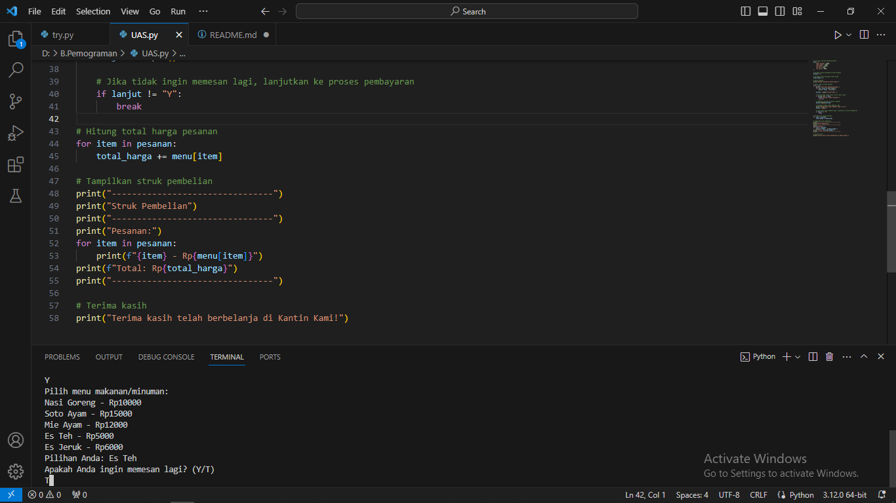

# UAS-Project

## Link Video Pengerjaan
1. https://www.youtube.com/watch?v=7Qo91PHOV4o
2. Sedang Proses Upload (menampilkan presenternya)

## berikut kode program project UAS


```python
# List opsi pilihan makanan/minuman
menu = {
    "Nasi Goreng": 10000,
    "Soto Ayam": 15000,
    "Mie Ayam": 12000,
    "Es Teh": 5000,
    "Es Jeruk": 6000,
}

# Variabel untuk menyimpan pilihan makanan
pesanan = []

# Variabel untuk menyimpan total harga
total_harga = 0

# Mulai program
print("Selamat datang di Kantin Kami!")

# Ambil input pilihan makanan
while True:
    print("Pilih menu makanan/minuman:")
    for key, value in menu.items():
        print(f"{key} - Rp{value}")

    pilihan = input("Pilihan Anda: ")

    # Jika pilihan tidak valid, minta input ulang
    if pilihan not in menu:
        print("Pilihan tidak tersedia!")
        continue

    # Tambahkan pilihan ke daftar pesanan
    pesanan.append(pilihan)

    # Tanyakan apakah ingin memesan lagi
    print("Apakah Anda ingin memesan lagi? (Y/T)")
    lanjut = input()

    # Jika tidak ingin memesan lagi, lanjutkan ke proses pembayaran
    if lanjut != "Y":
        break

# Hitung total harga pesanan
for item in pesanan:
    total_harga += menu[item]

# Tampilkan struk pembelian
print("--------------------------------")
print("Struk Pembelian")
print("--------------------------------")
print("Pesanan:")
for item in pesanan:
    print(f"{item} - Rp{menu[item]}")
print(f"Total: Rp{total_harga}")
print("--------------------------------")

# Terima kasih
print("Terima kasih telah berbelanja di Kantin Kami!")
```

## Demo Program




